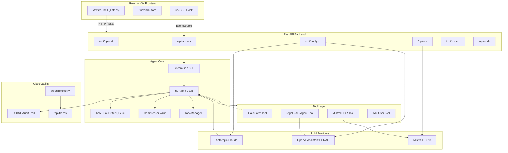

# Tax.AI

A locally-hosted, AI-powered tax preparation assistant that mirrors the TurboTax guided experience. Tax.AI combines Mistral OCR for document extraction, dual-LLM analysis (Anthropic Claude + OpenAI Assistants with RAG), a confidence scoring engine, and a full audit trail — all orchestrated by an autonomous agentic backend inspired by Claude Code's architecture.

> **MVP scope:** Federal W-2 and 1099-series forms only. Single-user, local-only — no e-filing, no cloud deployment, no authentication.

### Demo

<div align="center">
  <a href="https://vimeo.com/1169434824?share=copy&fl=sv&fe=ci">
    
    <br/>
    
  </a>
</div>

---

## Key Features

- **9-step wizard UI** — Filing status, personal info, document upload, OCR review, income summary, deductions & credits, analysis, results, and Form 1040 viewer with inline PDF display.
- **Mistral OCR 3** — Extracts structured fields (employer EIN, wages, withholding, etc.) from uploaded PDF/JPEG/PNG tax documents.
- **Dual-LLM analysis** — Claude performs primary tax computation; OpenAI Assistants (with Vector Store RAG) provides independent validation. Both run concurrently.
- **Confidence scoring & flagging** — GREEN/AMBER/RED/YELLOW flags based on per-model confidence scores and inter-model liability delta.
- **IRS Form 1040 generation** — Fills and validates a real IRS AcroForm 1040 PDF with 23 mapped fields (identity, wages, AGI, deductions, tax, refund/owed). Inline viewer with download and full-screen display.
- **Deterministic tax calculator** — Exact 2025 federal bracket math, FICA/Medicare, standard-vs-itemized comparison, and credit application with no LLM approximation.
- **Agentic orchestration (n0 loop)** — Master loop with TodoWrite planning, h2A async dual-buffer for mid-task user interjections, context compression, retry with exponential backoff on transient API errors, and persistent CLAUDE.md memory.
- **Real-time SSE streaming** — Typed events (thought, tool_call, tool_result, answer, ask_user, error, compression) streamed live to the React frontend.
- **Audit trail** — Append-only JSONL log of every tax-relevant action with PII masking. Generates PDF and JSON audit reports suitable for CPA review.
- **OpenTelemetry tracing** — Hierarchical spans (Agent → Cycle → Model Invoke → Tool) saved locally as JSON-lines and viewable via the built-in `/api/traces` endpoint. No Docker or external services required.

---

## Architecture



### Data Flow

1. **Upload** — User uploads tax documents (PDF/JPEG/PNG) via drag-and-drop. Files are saved to `backend/uploads/`, hashed (SHA-256), and a `TaxDocument` record is returned.
2. **OCR** — Each document is sent to Mistral OCR 3. Extracted fields (employer name, EIN, wages, withholding) are returned and displayed for user review.
3. **Review & Correct** — User verifies OCR output. Corrections are saved with original values for audit.
4. **Analysis** — Validated tax data is dispatched concurrently to Claude and OpenAI. Each produces an estimated liability, deductions/credits, advisory notes, and a confidence score.
5. **Scoring** — The scoring engine compares both results. Flag rules: GREEN (both ≥ 90% confidence, ≤ 10% liability delta), AMBER (one < 90%), RED (> 10% delta), YELLOW (one provider failed).
6. **Form 1040 Generation** — The n0 agent calls `form1040_tool` with the computed tax data. A filled IRS AcroForm 1040 PDF is generated with 23 fields (identity, wages, AGI, deductions, tax, withholding, refund/owed).
7. **Results** — The wizard shows side-by-side LLM results, the consensus liability, flag status, and a downloadable PDF audit report.
8. **Form 1040 Viewer** — The final step displays the filled 1040 inline via an embedded PDF viewer with download and full-screen options.

---

## Repository Layout

```
Tax.AI/
├── backend/                  # Python backend (FastAPI + agentic core)
│   ├── main.py               # App entry point — uvicorn + FastAPI
│   ├── config.py              # Pydantic Settings (env vars)
│   ├── api/                   # REST + SSE route handlers
│   │   ├── upload.py          # Document upload/delete
│   │   ├── ocr.py             # OCR trigger, field correction
│   │   ├── analyze.py         # Dual-LLM analysis
│   │   ├── wizard.py          # Wizard state CRUD
│   │   ├── stream.py          # SSE streaming + n0 agent chat
│   │   ├── forms.py           # Form 1040 download + status
│   │   ├── audit.py           # Audit trail + report endpoints
│   │   └── traces.py          # Trace viewer API
│   ├── agent/                 # Agentic orchestration
│   │   ├── n0_loop.py         # Master agent loop (7-phase cycle)
│   │   ├── h2a_queue.py       # Async dual-buffer message queue
│   │   ├── streamgen.py       # SSE event emitter
│   │   ├── todo_manager.py    # TodoWrite planning system
│   │   └── compressor.py      # Context window compressor (wU2)
│   ├── agents/                # Higher-level agent definitions
│   │   └── tax_analysis_agent.py
│   ├── services/              # LLM provider wrappers
│   │   ├── anthropic_analyzer.py
│   │   ├── openai_assistant.py
│   │   └── scoring_engine.py  # Dual-LLM comparison + flagging
│   ├── tools/                 # Registered n0 tools
│   │   ├── registry.py        # Tool definitions + dispatch
│   │   ├── calculator_tool.py # Deterministic tax math
│   │   ├── mistral_ocr_tool.py
│   │   ├── legal_rag_tool.py  # OpenAI RAG agent
│   │   ├── ask_user_tool.py   # Human-in-the-loop via SSE
│   │   └── form1040_tool.py   # IRS 1040 AcroForm PDF filler
│   ├── forms/                  # Form 1040 templates and output
│   │   ├── form1040_field_map.json  # Semantic → PDF field mapping
│   │   └── output/             # Generated filled 1040 PDFs
│   ├── models/                # Pydantic models
│   │   ├── tax_document.py
│   │   ├── wizard_state.py
│   │   ├── analysis_result.py
│   │   └── sse_events.py
│   ├── audit/                 # Audit logging + report generation
│   │   ├── audit_logger.py
│   │   └── report_generator.py
│   ├── telemetry/             # OpenTelemetry setup
│   │   ├── config.py          # Provider + exporter init
│   │   ├── file_exporter.py   # JSON-lines file span exporter
│   │   ├── tracer.py
│   │   └── attributes.py
│   ├── utils/
│   │   └── pii.py             # PII masking
│   └── src/
│       └── LEGAL_EXPERT_AGENT.py
├── frontend/                  # React + Vite SPA
│   ├── src/
│   │   ├── main.tsx           # React root mount
│   │   ├── App.tsx            # Layout — WizardShell + TodoSidebar
│   │   ├── components/
│   │   │   ├── WizardShell.tsx        # Step navigation + progress bar
│   │   │   ├── ConfidenceGauge.tsx
│   │   │   ├── steps/                 # One component per wizard step
│   │   │   │   ├── Step1FilingStatus.tsx
│   │   │   │   ├── Step2Upload.tsx
│   │   │   │   ├── Step3OCRReview.tsx
│   │   │   │   ├── Step4Income.tsx
│   │   │   │   ├── Step5Deductions.tsx
│   │   │   │   ├── Step6Analysis.tsx
│   │   │   │   ├── Step7Results.tsx
│   │   │   │   └── Step9Form1040Viewer.tsx
│   │   │   └── agent/
│   │   │       ├── AskUserModal.tsx    # Human-in-the-loop prompt
│   │   │       └── TodoSidebar.tsx     # Agent task progress
│   │   ├── hooks/
│   │   │   ├── useWizard.ts           # Step visibility logic
│   │   │   └── useSSE.ts              # SSE event listener
│   │   ├── store/
│   │   │   └── useWizardStore.ts      # Zustand state (persisted)
│   │   └── services/
│   │       └── api.ts                 # Backend API client
│   ├── index.html
│   ├── package.json
│   ├── vite.config.ts
│   └── tsconfig.json
├── tests/                     # Pytest test suites
│   ├── test_e2e_tax_scenario.py       # Full pipeline E2E (5 profiles)
│   ├── test_digital_twin_ts01.py      # Digital twin smoke test
│   ├── e2e/
│   │   ├── conftest.py
│   │   └── tax_summary_report.py      # IRS 1040-style report renderer
│   └── digital_twin/                  # Digital twin testing framework
│       ├── orchestrator.py
│       ├── evaluation.py
│       ├── conftest.py
│       ├── scenarios/
│       │   └── TS-01-happy-path.yaml
│       ├── factories/
│       │   ├── taxpayer_factory.py
│       │   └── document_renderer.py
│       └── mocks/
│           ├── twin_config.py
│           ├── claude_mock.py
│           └── mistral_mock.py
├── Notebooks/
│   └── 00a. Create Knowledge Base (Tax).ipynb
├── Documents/
│   └── AI_Tax_Assistant_PRD.md        # Full product requirements
├── scripts/
│   ├── start.sh                       # One-command full-stack launcher
│   └── start-tracing.sh               # Optional: launch Jaeger for richer trace UI
├── requirements.txt
├── .env.example
└── .gitignore
```

---

## Prerequisites

| Tool | Version | Notes |
|------|---------|-------|
| Python | 3.11+ | Tested with 3.13 |
| Node.js | 18+ | For the React frontend |
| npm | 9+ | Comes with Node.js |

You will also need API keys for the LLM providers you want to use:

- **Anthropic** — required for primary analysis and the n0 agent loop.
- **OpenAI** — required for RAG-grounded validation (Assistants API + Vector Store).
- **Mistral** — required for OCR document extraction.

---

## Local Setup

### 1. Clone and enter the project

```bash
cd Tax.AI
```

### 2. Create a Python virtual environment and install dependencies

```bash
python -m venv .venv
source .venv/bin/activate   # On Windows: .venv\Scripts\activate
pip install -r requirements.txt
```

### 3. Install frontend dependencies

```bash
cd frontend
npm install
cd ..
```

### 4. Configure environment variables

```bash
cp .env.example .env
```

Open `.env` and fill in your API keys (see [Environment Variables](#environment-variables) below).

---

## Running the App

### One-command start (recommended)

```bash
bash scripts/start.sh
```

This launches the backend and frontend in a single terminal. Tracing is built-in — spans are written to `backend/traces/` automatically and viewable at http://localhost:8000/api/traces. Press `Ctrl+C` to stop everything.

### Or start each service manually

#### Start the backend (FastAPI)

```bash
source .venv/bin/activate
python -m backend.main
```

The API server starts at **http://localhost:8000**. Docs are available at http://localhost:8000/docs.

#### Start the frontend (Vite dev server)

In a separate terminal:

```bash
cd frontend
npm run dev
```

The UI opens at **http://localhost:5173**. The Vite dev server proxies all `/api` requests to `localhost:8000`, so both servers must be running.

#### Health check

```bash
curl http://localhost:8000/api/health
# {"status":"ok","version":"1.0.0"}
```

---

## Environment Variables

Copy `.env.example` to `.env` and configure the values below.

### Required

| Variable | Description |
|----------|-------------|
| `OPENAI_API_KEY` | OpenAI API key (Assistants API + RAG) |
| `ANTHROPIC_API_KEY` | Anthropic API key (Claude models) |
| `MISTRAL_API_KEY` | Mistral API key (OCR) |

### LLM Models

| Variable | Default | Description |
|----------|---------|-------------|
| `OCR_MODEL` | `mistral-ocr-2512` | Mistral model for document OCR |
| `ANTHROPIDC_ADVANCE_LLM_MODEL` | `claude-opus-4-6` | Primary Claude model for n0 agent loop and analysis |
| `ANTHROPIC_MEDIUM_LLM_MODEL` | `claude-sonnet-4-6` | Mid-tier Claude model |
| `ANTHROPIC_LOW_LLM_MODEL` | `claude-haiku-4-5` | Lightweight model (context compression) |
| `OPENAI_VERY_ADVANCE_LLM_MODEL` | `gpt-4o` | Top-tier OpenAI model |
| `OPENAI_ADVANCE_LLM_MODEL` | `gpt-4o` | OpenAI analysis model |
| `OPENAI_MEDIUM_LLM_MODEL` | `gpt-4o-mini` | Lighter OpenAI model |

### Optional

| Variable | Default | Description |
|----------|---------|-------------|
| `TAX_VECTOR_STORE` | `""` | OpenAI Vector Store ID for RAG retrieval. Create one via the notebook in `Notebooks/`. |
| `OTEL_EXPORTER_ENDPOINT` | `""` (disabled) | OTLP gRPC endpoint. Set to `http://localhost:4317` to also export to Jaeger. |
| `OTEL_CONSOLE_EXPORT` | `false` | Also print spans to stdout |
| `TODO_MAX_ITERATIONS` | `25` | Safety cap on n0 agent loop iterations |
| `CONTEXT_WINDOW_THRESHOLD` | `0.75` | Context utilization ratio that triggers compression |
| `MISTRAL_VERIFY_SSL` | `true` | Set to `false` to skip SSL certificate verification for Mistral API (useful behind corporate proxies) |
| `MAX_UPLOAD_SIZE_MB` | `20` | Maximum file upload size in MB |

---

## API Endpoints

All endpoints are mounted under the `/api` prefix.

### Upload

| Method | Path | Description |
|--------|------|-------------|
| `POST` | `/api/upload` | Upload a tax document (multipart form: `file` + `session_id`). Returns a `TaxDocument`. |
| `DELETE` | `/api/upload/{file_id}` | Remove an uploaded document by ID. |

### OCR

| Method | Path | Description |
|--------|------|-------------|
| `POST` | `/api/ocr/{file_id}` | Trigger Mistral OCR on an uploaded document. Returns extracted fields. |
| `PUT` | `/api/ocr/{file_id}/fields` | Submit user corrections to OCR-extracted fields. |
| `GET` | `/api/ocr/{file_id}` | Retrieve stored OCR results for a document. |

### Wizard State

| Method | Path | Description |
|--------|------|-------------|
| `GET` | `/api/wizard/state?session_id=...` | Get current wizard state for a session (creates one if new). |
| `PUT` | `/api/wizard/state` | Update wizard state. |

### Analysis

| Method | Path | Description |
|--------|------|-------------|
| `POST` | `/api/analyze` | Run dual-LLM analysis (Claude + OpenAI concurrently). Body: `{session_id, tax_data}`. |
| `GET` | `/api/analyze/{session_id}/results` | Retrieve cached analysis results. |

### Streaming (Agent Chat)

| Method | Path | Description |
|--------|------|-------------|
| `POST` | `/api/stream/chat` | Start an n0 agent loop for a session. Body: `{session_id, message}`. |
| `GET` | `/api/stream?session_id=...` | SSE event stream — connect via `EventSource`. |
| `POST` | `/api/stream/respond` | Inject a user answer to a pending `ask_user` question. Body: `{session_id, question_id, answer}`. |
| `POST` | `/api/stream/message` | Inject a mid-task user message into the h2A buffer. Body: `{session_id, message}`. |

### Audit

| Method | Path | Description |
|--------|------|-------------|
| `GET` | `/api/audit/trail/{session_id}` | Stream the JSONL audit trail for a session. |
| `GET` | `/api/audit/report/{session_id}` | Generate and download a PDF audit report. |
| `GET` | `/api/audit/report/{session_id}/json` | Generate and download a JSON audit report. |
| `POST` | `/api/audit/acknowledge` | Record user acknowledgment of a RED flag. Body: `{session_id}`. |

### Traces

| Method | Path | Description |
|--------|------|-------------|
| `GET` | `/api/traces` | List recent traces grouped by trace_id. Query param: `limit` (default 50, max 200). |
| `GET` | `/api/traces/{trace_id}` | Get all spans for a specific trace. |

### Forms (Final 1040)

| Method | Path | Description |
|--------|------|-------------|
| `GET` | `/api/forms/1040/template-fields` | List fillable Form 1040 AcroForm field names and semantic mapping readiness. |
| `GET` | `/api/forms/1040/{session_id}/status` | Get Form 1040 generation status for a session, including missing required fields. |
| `GET` | `/api/forms/1040/{session_id}` | Download generated filled Form 1040 PDF for a session (when successful). |

### Health

| Method | Path | Description |
|--------|------|-------------|
| `GET` | `/api/health` | Returns `{"status": "ok", "version": "1.0.0"}`. |

---

## Testing

Tests use **pytest** and do not require live API keys -- LLM and OCR calls are mocked. Tests are organized by marker so you can run subsets independently.

### Run tests

```bash
source .venv/bin/activate

# All offline tests (no backend needed) — 97 tests
pytest tests/ -m "not integration" -v

# Integration tests (requires a running backend at localhost:8000)
pytest tests/ -m integration -v

# Everything
pytest tests/ -v
```

### Test suites

| Suite | File | Tests | What it covers |
|-------|------|-------|----------------|
| Scoring engine | `tests/test_scoring_engine.py` | 19 | All flag statuses (GREEN, AMBER, RED, YELLOW), boundary conditions, consensus calculation, edge cases |
| Calculator | `tests/test_calculator_comprehensive.py` | 36 | All 5 filing statuses, all 5 profiles vs ground truth, FICA/Medicare, deduction comparison, credits, bracket edge cases |
| Digital twin edge cases | `tests/test_digital_twin_edge_cases.py` | 17 | Offline fault injection for scenarios TS-07 through TS-12: low confidence, hallucination, provider failure, both-fail, slow response, Evaluator logic |
| E2E flag scenarios | `tests/test_e2e_flag_scenarios.py` | 19 | Full calculator + scoring + audit pipeline for AMBER, RED, YELLOW flags across all profiles |
| E2E pipeline | `tests/test_e2e_tax_scenario.py` | 5 | Full pipeline (calculator, dual-LLM scoring, audit JSONL, 1040-style report, PDF) across all 5 profiles |
| Digital twin smoke | `tests/test_digital_twin_ts01.py` | 2 | TS-01 happy path via orchestrator + calculator unit test |
| Digital twin all profiles | `tests/test_digital_twin_all.py` | 7 | Integration: all 5 profiles through the orchestrator, degraded mode, latency bounds |
| Digital twin framework | `tests/digital_twin/` | -- | Orchestrator, evaluator, mock servers (Claude, Mistral), taxpayer factory, 12 scenario YAMLs |

### Scenario coverage (12 scenarios)

| ID | Name | Expected flag | Mode |
|----|------|---------------|------|
| TS-01 | Single filer, W-2 only | GREEN | All perfect |
| TS-02 | MFJ, W-2+1099, itemized, CTC | GREEN | All perfect |
| TS-03 | Self-employed, Schedule C, EIC | GREEN | All perfect |
| TS-04 | High income, 35% bracket | GREEN | All perfect |
| TS-05 | MFJ retiree, SS+pension | GREEN | All perfect |
| TS-06 | Degraded OCR | GREEN | Mistral: degraded |
| TS-07 | Low confidence | AMBER | Claude: accurate_low |
| TS-08 | Hallucination | RED | Claude: hallucinated |
| TS-09 | Claude failure | YELLOW | Claude: failure |
| TS-10 | OpenAI failure | YELLOW | OpenAI: failure |
| TS-11 | Both providers fail | RED | Both: failure |
| TS-12 | Slow response | GREEN | Claude: slow |

---

## Observability & Audit

### Audit Trail

Every tax-relevant action is logged as a JSONL event to `backend/audit/`. Events include document uploads, OCR results, tool invocations, analysis outcomes, scoring flags, and user corrections. PII is masked before being sent to LLMs.

### Audit Reports

PDF and JSON audit reports are generated per session and are accessible via the `/api/audit/report/{session_id}` endpoints. Reports include the full event timeline, scoring results, and flag rationale.

### OpenTelemetry Tracing (built-in)

Tracing works out of the box — no Docker or external services required. All spans are written as JSON-lines to `backend/traces/` (daily rolling files) and are queryable via the API:

| Method | Path | Description |
|--------|------|-------------|
| `GET` | `/api/traces` | List recent traces grouped by trace_id |
| `GET` | `/api/traces/{trace_id}` | Get all spans for a specific trace |

Traces include hierarchical spans: `Agent → Cycle → Model Invoke → Tool`, with token counts and latency on each model invocation.

#### Optional: Jaeger UI

For a richer visual trace explorer, you can optionally run Jaeger alongside the built-in tracing:

```bash
bash scripts/start-tracing.sh
```

Then set `OTEL_EXPORTER_ENDPOINT="http://localhost:4317"` in `.env` to forward spans to Jaeger in addition to the local file exporter. Jaeger UI will be available at http://localhost:16686.

---

## Known Constraints (MVP)

- **Single-user** — No authentication or multi-tenancy. Session state is held in-memory.
- **In-memory stores** — OCR results, analysis cache, and wizard state are stored in Python dicts. A server restart clears them (uploaded files persist on disk).
- **Federal only** — 2025 federal tax brackets; no state-level forms.
- **Form coverage** — W-2 and 1099-series (NEC, MISC, INT, DIV). Schedule C, K-1, and other complex forms are out of scope.
- **No e-filing** — Generates summary reports for manual filing or CPA review.
- **Local deployment** — Runs on localhost via uvicorn; no containerized or cloud deployment config.

---

## Troubleshooting

| Symptom | Likely cause | Fix |
|---------|--------------|-----|
| `ANTHROPIC_API_KEY` / `OPENAI_API_KEY` errors on startup | `.env` file missing or keys not set | Copy `.env.example` to `.env` and add valid keys. |
| Frontend shows network errors | Backend not running or wrong port | Ensure `python -m backend.main` is running on port 8000. The Vite proxy in `vite.config.ts` forwards `/api` to `localhost:8000`. |
| OCR returns 500 | Mistral API key missing or invalid | Set `MISTRAL_API_KEY` in `.env`. Check the Mistral API dashboard for quota. |
| OCR fails with `CERTIFICATE_VERIFY_FAILED` | macOS Python can't verify Mistral's SSL cert (corporate proxy or missing root CAs) | Set `MISTRAL_VERIFY_SSL=false` in `.env`. Alternatively, run `/Applications/Python\ 3.13/Install\ Certificates.command` to install root CAs for your Python version. |
| Audit report PDF generation fails | `reportlab` not installed | Run `pip install -r requirements.txt` to ensure all deps are present. |
| Traces not appearing at `/api/traces` | Backend just started, no requests yet | Traces are written after requests complete. Make a request (e.g. `/api/health`) and check again. Trace files are in `backend/traces/`. |
| `ModuleNotFoundError: backend.*` | Running from wrong directory | Run all commands from the project root (`Tax.AI/`). Python resolves `backend` as a package from this directory. |
| Upload rejected (413) | File exceeds size limit | Default is 20 MB. Increase `MAX_UPLOAD_SIZE_MB` in `.env` if needed. |

---

## License

Personal project. See `Documents/AI_Tax_Assistant_PRD.md` for the full product requirements document.
